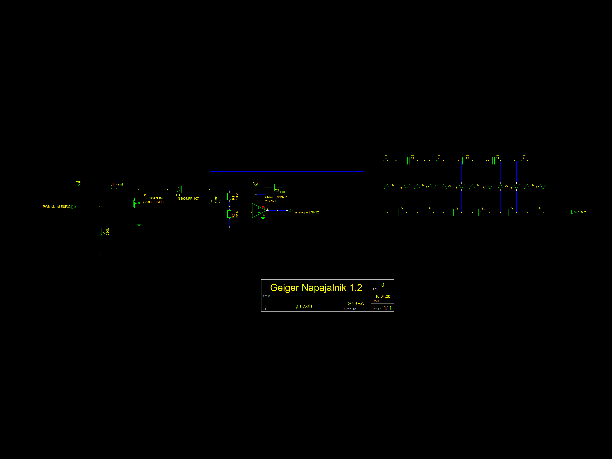

# GeigerCounter

Osnovo (napajalni del) je [razvil Sebastjan Pleško](http://seba.eu.org/public/geiger/):

*Različica sheme: 1.2*

## Strojna oprema

### Različica 2 (že razvito)

Vezje je zasnovano v SMD tehniki. Vse komponente so splošno dostopne in imajo široke tolerance oz. so čim manj občutljive. Vezje je zgrajeno okrog ESP8266 (NodeMCU v3), ki ima 3.3 V izhode. Napetost na Geigerjevi cevi se nastavlja s pomočjo ESP8266, kjer s pomočjo PWM signala in množilnika napetosti programsko nastavljamo končno napetost na Geigerjevi cevi (s pomočjo tim. [boost converter-ja](https://en.wikipedia.org/wiki/Boost_converter)). S povratnim pinom (na ESP8266) merimo (preverjamo) napetost na cevi.

Ker vezje omogoča programsko nastavljanje napetosti, lahko na vezje priključimo katerokoli Geigerjevo cev (različne Geigerjeve cevi namreč delujejo pri različnih napetostih, npr. SBM-20 na 400 V, LND-712 na 560 V, itd.
 
 - [Seznam in primerjava Geigerjevih cevi](https://sites.google.com/site/diygeigercounter/technical/gm-tubes-supported?authuser=0).

### 1) Različna podnožja
Namesto ESP8266 (NodeMCU) bo mogoče uporabiti Arduino Nano, ESP32 ali druge ESP module (TTGO,..), ki se jih bo vstavilo v podnožje naprave.

### 2) Napajalni del
Napajanje lahko poteka preko USB vrat ali neposredno preko PIN-ov (neregulirana napetost preko voltage regulatorja ali  regulirana napetost).

Dodati je treba baterije (11865 ali 21700) ter polnilni del.

### 3) Zaslon in gumbi
Dodati je potrebno zaslon. Uporabili bomo zaslon Nokie 5110 ter dodali nekaj programabilnih gumbov (*push button*).

### 4) Merjenje sevanja z diodami
Dodati je treba možnost merjenja sevanja (energije?) s fotodiodami. Uporabili bomo fotodiodo BPW34. Dve ideji:
 - [Portable Radiation Detector](https://www.instructables.com/id/Radiation-Detector/)
 - [Pocket Photodiode Geiger Counter](https://www.instructables.com/id/Pocket-Photodiode-Geiger-Counter/)

### 5) MOSFET tranzistor
Dodati je treba se MOSFET tranzistor ki bi, ko zazna delec, kratkostičil Geigerjevo cev. Če narediš to kratkostičenje potem imaš (teoretično) 10 - 100x višji razpon v katerem meriš radiacijo. Nadalje, ker mikrokontroler generira PWM za napajanje cevi in ima direkten feedback loop lahko preko tega tudi zaznaš če je preveč radiacije oz. je radiacija nad mejo. Takrat namreč cev stalno prevaja. Za to [obstaja patent št. US4453076A](https://patentimages.storage.googleapis.com/74/59/dc/d22516a8492bd9/US4453076.pdf).

### 6) Shranjevanje podatkov
Dodati je treba modul za SD kartico, na katero se bodo zapisovali podatki

### 7) Komunikacija
NodeMCU podpira WiFi in Bluetooth povezave. V prihodnosti bo potrebno dodati možnost LoRa povezave.

### 8) Zaščita vezja
Vezje bomo premazali z mešanico epoksi smole, zmešane z barijevim sulfatom. S tem bi dobili dobro zaščito pred radiacijo. Barijev sulfat je poceni, netopen v vodi, neprevoden in nestrupen. Preveriti je potrebno kakšno mešanico ponuja podjetje OMF.

### 9) GPS modul
Dodati je treba možnost priklop GPS modula (če bo naprava mobilna oz montirana na dronu).

## Ohišje
Ko bo izdelana končna različica naprave bomo izdelali 3D model plastičnega ohišja, ki ga je mogoče natisniti s 3D tiskalnikom.

## Strojna programska oprema
Naprava bo na zaslonu prikazovala trenutno izmerjeno vrednost ter povprečje za zadnjih X minut.

Alarm funkcija: ob povečani stopnji sevanja zaprava začne piskati in oddajati svetlobne signale. Mejo je mogoče nastaviti programsko.

Izračunati je potrebno porabo celotnega vezja, implementirati spalni način in izračunati porabo v spalnem načinu.

Indikator baterije.

Radiacijo merimo s fotodiodami in Geigerjevo cevjo. S tem bi lahko merili število delcev in energijo delcev hkrati.

### Naprednejše merjenje 
Če je dovolj visoka radiacija, z mikrokrimilnikom znižamo napetost, da naprava pride iz Geiger območja v proporcionalno območje. V Geiger območju ob sevanju dobimo pulz, ki je vedno enak ne glede na energijo (Geigerjeva cev zaznava delce, ne pa njihove energije). V proporcionalnem območju (nižja napetost) pa je meritev sicer manj občutljivo, vendar pa je integral pulza proporcionalen energiji delca. S tem pa lahko potem izračunamo dejansko sevanje, oz. koliko energije ima posamezen delec.

Nadalje bi se dalo narediti tako, da merimo 10 sekund v proporcionalnem območju in 10 sekund v Geiger območju, in to alterniramo, in potem iz tega izračunamo dejansko koliko miligrayov na uro je sevanja, ne pa samo števila delcev na časovno enoto.

Opcija bi bila tudi uporaba dveh Geigerjevih cevi (napajalni del bi bil potem podvojen), kjer bi ena Geigerjeva cev delala na Geigerjevem območju, ena pa na proporcionalnem.

## Programska oprema
Uporabimo [BlueSensor JSON strukturo](https://github.com/MatejKovacic/BlueSensor#our-json-format) senzorskih podatkov. 

Podatki se ne zbirajo v centralni bazi, pač pa distribuirano (ideja: [IPFS](https://ipfs.io/)?).

Spletna aplikacija za prikaz podatkov.

## Razno
 - [CMOS tipalo](https://hackaday.com/2012/01/15/turn-your-camera-phone-into-a-geiger-counter/)
 - [Type 5 Pocket Geiger Radiation Sensor](https://www.sparkfun.com/products/14209) (to je verjetno kar CMOS senzor, zavit v bakreno folijo?)
 - [Silicon photodiodes for gamma ray detection](http://www.terezakis.me/wp-content/uploads//2014/02/gamma-ray-detection_0.pdf)
