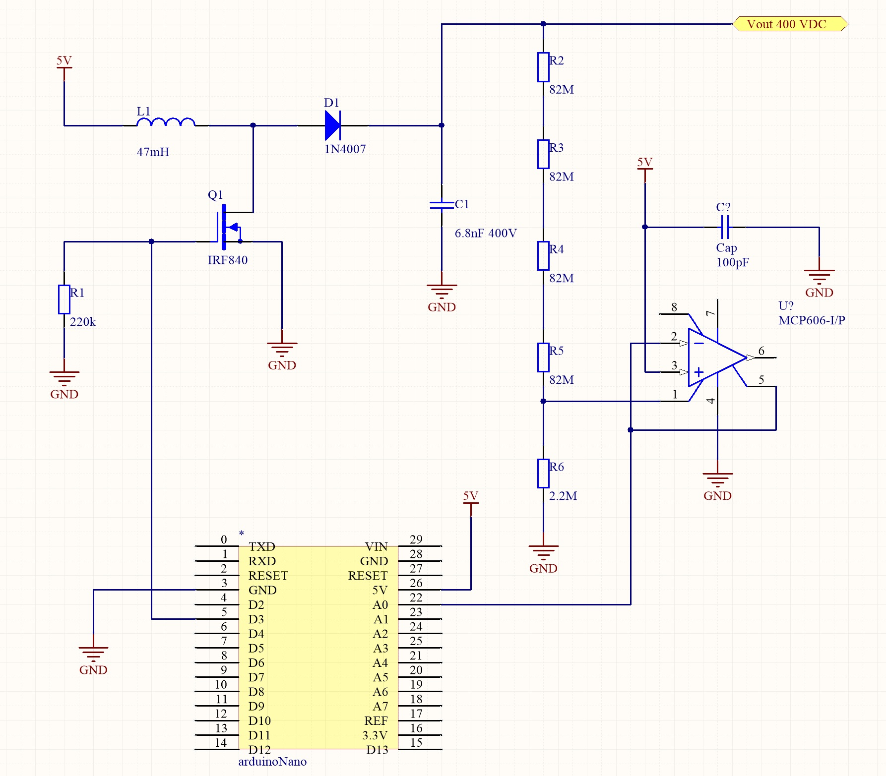

# GeigerCounter

Osnova: http://seba.eu.org/public/geiger/

## Ideja 1

Dodamo voltage doublerje (dioda + kondenzator) 2x. Podobno idejo ima implementirano [Maxmintegrated](https://www.maximintegrated.com/en/design/technical-documents/app-notes/3/3757.html). Razlika je, da je ta Maximov načrt bolj "analogen", napetost je treba nastavljati na roke, povratna zanka pa je pri neki nižji napetosti, ki se jo dvigne z voltage
multiplierji.

## Ideja 2
Vse komponente morajo biti splošno dostopne, vse mora imeti zelo široke tolerance oz. ne sme biti občutljivo. Zato bi bilo treba izboljšati povratno zanko, ki je sedaj narejena z 4x82M Ohm uporom, lahko pa bi uporabili 10M Ohm upore in potem voltage multiplierje več stopenj.

Prednost tega bi bila, da bi bolje delalo na baterije, poleg tega se 82M upore malo težje dobi, ter če se bodo umazali skozi leta, bo narobe delalo. Predlog: naredi se tako, da imaš 1 upor od 10 M Ohm potem pa izhod narediš recimo x8 z voltage doublerji.

## Ideja 3
Trenutna verzija troši 300 mikroamperov na 5V, se pravi 1.5 mW, ampak bi se dalo narediti izboljšave.

## Ideja 4
Doda se MOSFET tranzistor ki bi, ko zazna delec, kratkostičil Geigerjevo cev. Če narediš to kratkostičenje potem imaš (teoretično) 10 - 100x višji razpon v katerem meriš radiacijo. Nadalje, ker mikrokontroler generira PWM za napajanje cevi in ima direkten feedback loop lahko preko tega tudi zaznaš če je preveč radiacije oz. je radiacija nad mejo. Takrat namreč cev stalno prevaja. Za to [obstaja patent št. US4453076A](https://patentimages.storage.googleapis.com/74/59/dc/d22516a8492bd9/US4453076.pdf).

## Ideja 5
Zaščita vezja: vezje bi lahko premazali z mešanico epoksi smole, zmešane z barijevim sulfatom. S tem bi dobili dobro zaščito pred radiacijo. Barijev sulfat je poceni, netopen v vodi, neprevoden in nestrupen.

## Ideja 6
Če je dovolj visoka radiacija, znižaš napetost (z mikrokontrolerjem), da prideš iz Geiger območja v proporcionalno območje. Namreč, v Geiger območju ti zadeva da pulz enak ne glede na energijo (se pravi zaznava delce, ne pa njihove energije). V proporcionalnem območju (nižja napetost) pa je sicer manj občutljivo, ampak je integral pulza proporcionalen energiji delca. S tem pa lahko potem izračunaš dejansko sevanje, oz. koliko energije ima posamezen delec.

Nadalje bi se dalo narediti tako, da meriš 10 sekund v proporcionalnem območju in 10 sekund v Geiger območju, in to alterniraš, in potem iz tega izračunas dejansko kok miligrayov na uro je sevanja, ne pa samo števila delcev na časovno enoto.

## Ideja 7
Podatki se beležijo na SD kartico/notranji pomnilnik ter pošiljajo ven preko WiFi, Bluetooth ali LoRa povezave. Naprava ima display (OLED?), ki prikazuje trenutno izmerjeno vrednost/povprečje za zadnjih X minut. Podatki se ne zbirajo v centralni bazi, pač pa distribuirano (IPFS?).

## Ideja 8
Namesto Arduino Nano se uporabi ESP32. Pomembna razlika je, da ima ESP32 3V izhode, Arduino nano pa 5V izhode. Potrebno je poskrbeti tudi za napajanje. ESP32 se lahko napaja preko USB porta, neposredno preko PIN-ov 5V in GND (neregulirana napetost med 5V in 12V), ali neposredno preko PIN-ov 3.3V in GND (regulirana napetost 3.3V). Naprava mora imeti tudi OLED zaslon.

## Ideja 9
Dodati je treba baterije (11865 ali 21700) ter polnilni del.

## Ideja 10
Uporabi se lahko različne cevi ali fotodiode:
 - LND-712: 560V
 - SBM-20: 400 V
 - [CMOS tipalo](https://hackaday.com/2012/01/15/turn-your-camera-phone-into-a-geiger-counter/)
 - [Type 5 Pocket Geiger Radiation Sensor[(https://www.sparkfun.com/products/14209) (to je verjetno kar CMOS senzor, zavit v bakreno folijo?)
 - [Portable Radiation Detector](https://www.instructables.com/id/Radiation-Detector/)
 - [Pocket Photodiode Geiger Counter](https://www.instructables.com/id/Pocket-Photodiode-Geiger-Counter/)
 - [Silicon photodiodes for gamma ray detection](http://www.terezakis.me/wp-content/uploads//2014/02/gamma-ray-detection_0.pdf)
 
[Seznam in primerjava cevi](https://sites.google.com/site/diygeigercounter/technical/gm-tubes-supported?authuser=0).
